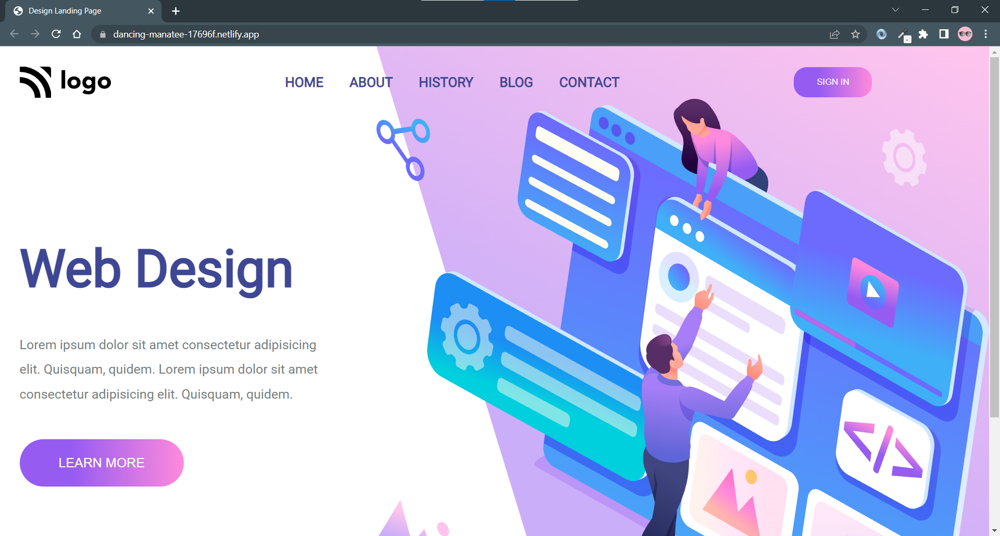

> # I am Sandeep Pal 🙏
👉 This is my 7 project on HTML and CSS.

👉 🎧 Headphone website

> # Learning
1️⃣ Flexbox 

  ✴️ Flexbox gives more control over the element.

  ✴️ Flexbox is one dimension 

  ✴️ Flexbox help divide element into column and row.
  
  ✴️ With the use of flexbox we can easily center the div 😄

  __USE__⚡
```html
  div{

    display:flex;
    justify-content:center;
    align-items:center;


  }
```

2️⃣ Again Position


> ## TIME🕑

🔛 It takes 4 Hour to complte this project.

> ### About More
⚠️ Website are not responsive but ASAP i make them responsive.

⚠️ Website was not complete complete website comes later days.

🔁 Update comes in future 


🔗[Live Link](https://super-valkyrie-421073.netlify.app/)